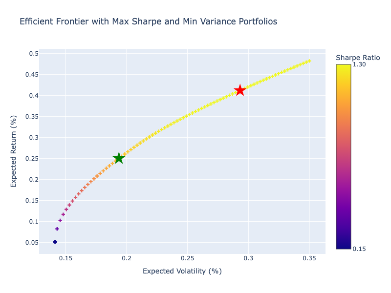

# 📈 Portfolio Optimization and efficient frontier - Lab 3
## Jan 2025, Python Labs from CQF by Kannan Singaravelu

This project implements **Portfolio Optimization** using Python, extracting financial data from a SQLite database and applying optimization techniques to build an efficient portfolio.

## 🚀 Features

- **Data Extraction**: Fetches historical stock prices from a SQLite database.

- **Data Preprocessing**: Cleans and structures price data for analysis.

- **Portfolio Optimization**: Computes optimal asset allocation using risk-return analysis.

- **Visualization**: Generates charts for portfolio weights and performance.

## 📂 File Structure
- **Data Extraction**: Fetches historical stock prices from a SQLite database.  
- **Data Preprocessing**: Cleans and structures price data for analysis.  
- **Portfolio Optimization**: Computes optimal asset allocation using risk-return analysis.  
- **Visualization**: Generates charts for portfolio weights and performance.  

## Steps to set up the environment and install the required libraries
1. Installing uv                            
    `pip install uv`

2. Create a virtual environment with Python 3.10 
    Note: Use a virtual environment with Python 3.10 for this program.
    `uv venv --python 3.10`

3. Activate the virtual environment
    `source .venv/bin/activate`
    `.venv\Scripts\activate` for Windows

4. Specify required python libraries in requirements.txt

5. Install required python libraries 
    `uv pip install -r requirements.txt`

6. Download & Install Visual Studio Code
    `https://code.visualstudio.com/download`    
    Note: you will need to install appropriate microsfot extensions for python, jupyter including pylance, etc.

7. Open the notebooks, use any of the following methods:
    a. Use the command `code .` to launch Visual Studio Code from the terminal.
    b. Use the command `jupyter lab` to launch Jupyter Lab from the terminal.

8. When you are done with the lab, close the Jupyter Lab and exit the virtual environment.
    `deactivate` from the terminal.

Important: Please note that the virtual environment is only active for the duration of the session. If you wish to use the virtual environment for other purposes, you will need to activate it again. Python Labs are designed to be run in a virtual environment, and you should not install any libraries outside of it. The Python Labs content is shared as HTML files for you to replicate the labs in your own environment. It will not be shared as `.ipynb` files, as this aligns with good software engineering practices.
